# Stratux FIS-B Weather Monitor

A single-page web application for monitoring FIS-B (Flight Information Services - Broadcast) weather data received by a [Stratux](https://stratux.me/) ADS-B receiver. Designed to run in any modern browser on a desktop, tablet, or phone connected to the Stratux Wi-Fi network.

## Quick Install

Download the [update-stratux-v1.0-fisb-weather.sh](https://github.com/egite/Stratux-FIS-B-Weather-Monitor/raw/refs/heads/main/update-stratux-v1.0-fisb-weather.sh) file to your phone.  Connect to your Stratux, go to the Settings page and select the gray "Click to select System Update file" button and chose the sh file.  Then hit the gray button again (it will have blue text saying "Install update-stratux-v1.0-fisb-weather.sh").  Wait for the Stratux to reboot and come back online.  You'll find a new menu item named "FIS-B Weather".

## Features

**Text weather products**
- METAR / SPECI, TAF, Winds Aloft, PIREP, NOTAM, AIRMET, SIGMET, CWA, SUA, D-ATIS, Tower coverage, RAW frame view
- Plain-English translation toggle for every product (decoded weather phenomena, sky conditions, remark groups, PIREP fields, NOTAM contractions, SUA type/status, etc.)
- Per-product station filters with wildcard support, configurable auto-expiry, distance filtering relative to ownship

**Graphical FIS-B products**
- Regional and CONUS NEXRAD, icing (low/high), turbulence (low/high), cloud tops, lightning
- Block-based RLE decoders with APDU reassembly, rendered on responsive canvases with state boundaries, ownship marker, pinch-to-zoom and drag-to-pan

**Ownship & towers**
- Live ownship position and track from GDL90 traffic reports
- FIS-B ground tower map with coverage rings and last-seen status pulled from the Stratux `/getTowers` endpoint

**Winds aloft animation**
- Time-lapse playback of winds aloft soundings with altitude scrubbing

**UI**
- Desktop and mobile layouts with explicit toggle (not just media-query auto-detect)
- Adjustable font scaling, dark theme, touch and mouse parity on all canvas views
- Self-contained: a single `Weather.html` file with all JavaScript, CSS, and CONUS boundary data inlined &mdash; no build step, no external CDN dependencies

## Installation

The intended deployment is on the Stratux device itself, served from the same web server that hosts the stock Stratux UI. The included `update-stratux-v1.0-fisb-weather.sh` installer patches a Stratux image to add a `stratux-fisb-buffer` systemd service (which captures FIS-B frames during boot so they aren't lost before the browser connects) and installs `Weather.html` alongside the stock UI. See [UPDATE-INSTRUCTIONS.md](UPDATE-INSTRUCTIONS.md) for details.

For development or read-only use, `Weather.html` can also be opened directly from disk &mdash; in that case it defaults to connecting to `192.168.10.1` (the standard Stratux IP).

## Architecture

- Two WebSocket connections to the Stratux device:
  - `/weather` &mdash; FIS-B text products (METAR, TAF, PIREP, NOTAM, SIGMET, AIRMET, CWA, SUA, D-ATIS, winds)
  - `/gdl90` &mdash; raw GDL90 frames carrying graphical FIS-B blocks and ownship reports
- HTTP `GET /getTowers` for the FIS-B ground tower list
- Host IP defaults to `window.location.host` when served by Stratux, with fallback to `192.168.10.1` for local-file use

## Sources

Built with reference to:

- [cyoung/stratux](https://github.com/cyoung/stratux) &mdash; Stratux ADS-B receiver: WebSocket API, weather/GDL90/tower endpoints, GDL90 protocol
- [rand-projects/fisb-decode](https://github.com/rand-projects/fisb-decode) &mdash; FIS-B product decoding reference: DLAC text, TWGO, graphical products, SUA, NOTAM, CRL, block numbering, RLE schemes

Additional sources:

- **FAA Order 7900.5 / FMH-1** (Federal Meteorological Handbook No. 1, *Surface Weather Observations and Reports*) &mdash; METAR/TAF weather phenomena codes, sky condition codes, remark groups (SLP, T-group, precipitation, pressure tendency, cloud types, lightning), wind barb symbology
- **FAA AC 00-45** (*Aviation Weather Services*) &mdash; PIREP field codes (`/OV /TM /FL /TP /SK /WX /TA /WV /TB /IC /RM`), turbulence and icing intensity codes
- **FAA JO 7340.2** (*Contractions*) &mdash; NOTAM abbreviation expansion (TWR, CLSD, RWY, OBST, MALSR, etc.)
- **RTCA DO-267A / DO-358B** &mdash; GDL90 ICD, DLAC character encoding, FIS-B product registry, graphical overlay specifications, SUA type/status codes
- **Natural Earth 10m Admin 1** (States/Provinces) &mdash; CONUS state boundary polygons ([naturalearthdata.com](https://www.naturalearthdata.com/), public domain)

## Files

- `Weather.html` &mdash; the entire application (all JavaScript, CSS, and inlined CONUS boundary data)
- `conus_map.js` &mdash; standalone backup of the CONUS boundary data (inlined into `Weather.html`)
- `update-stratux-v1.0-fisb-weather.sh` &mdash; self-extracting installer that patches a Stratux image
- `UPDATE-INSTRUCTIONS.md` &mdash; installer usage notes

## Disclaimer

This software is provided for situational awareness and educational use only. It is **not** approved for navigation. Always cross-check weather information against official sources before flight.

## Authorship

All code in this repository was authored by [Claude Code](https://claude.com/claude-code) (Anthropic), directed and reviewed by the repository owner.

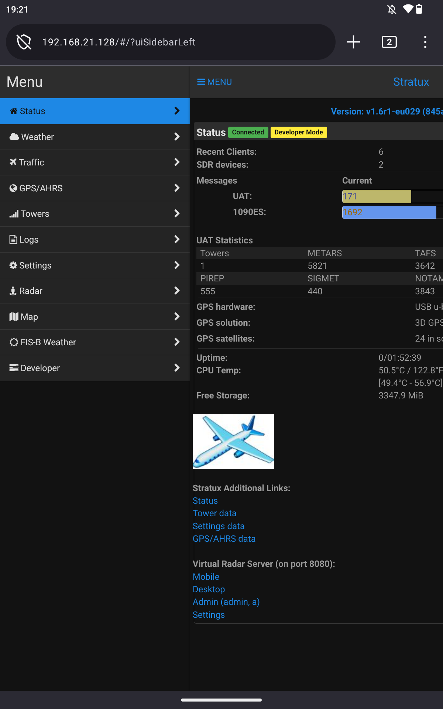
Note that this screenshot shows Virtual Radar server installed on this Stratux deployment.  You can add VRS to your Stratux here:  [irtual-Radar-Server-on-Stratux
](https://github.com/egite/Virtual-Radar-Server-on-Stratux)

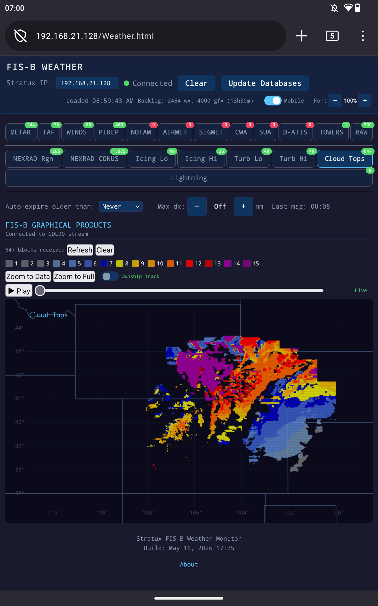

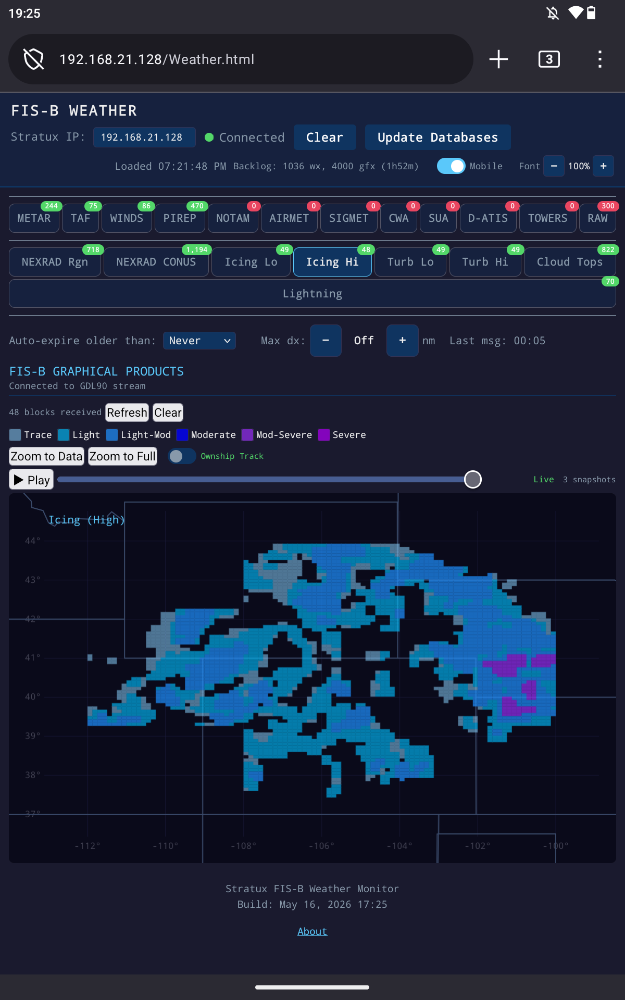

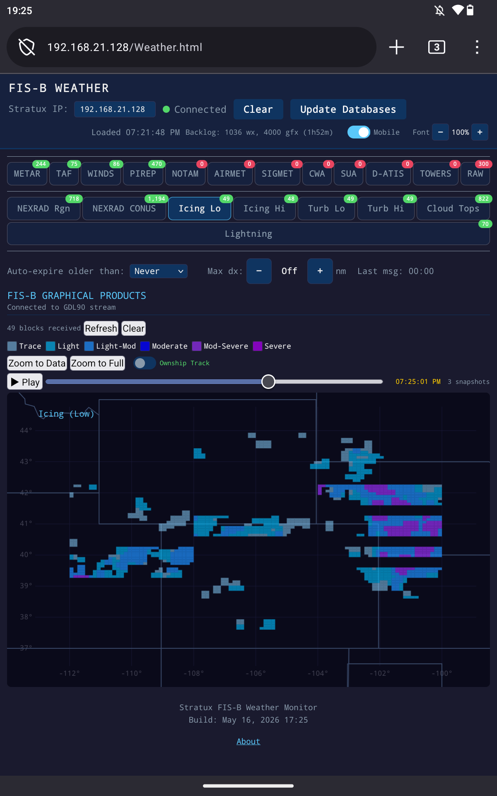

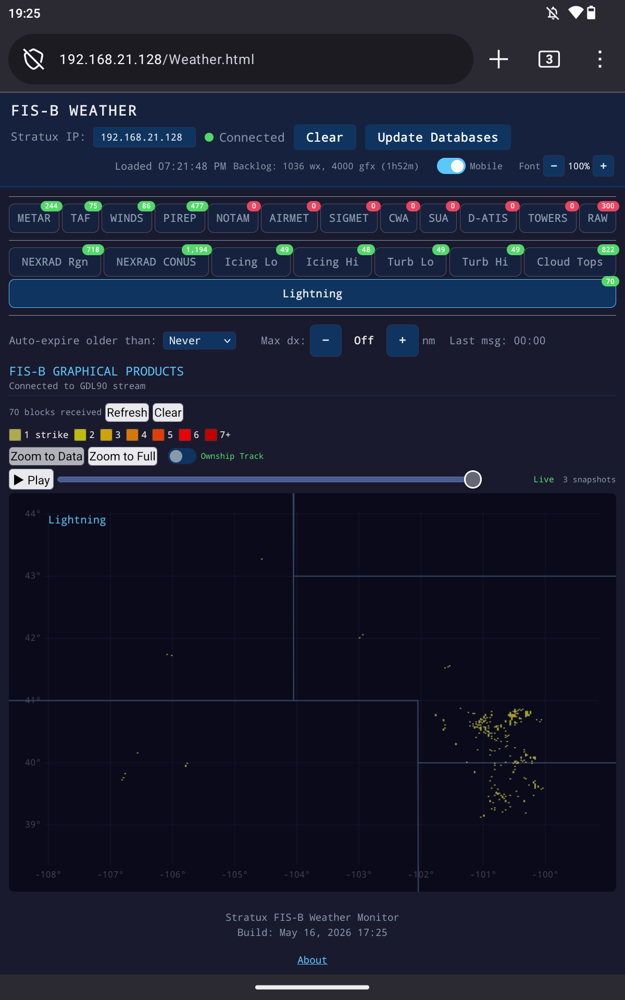

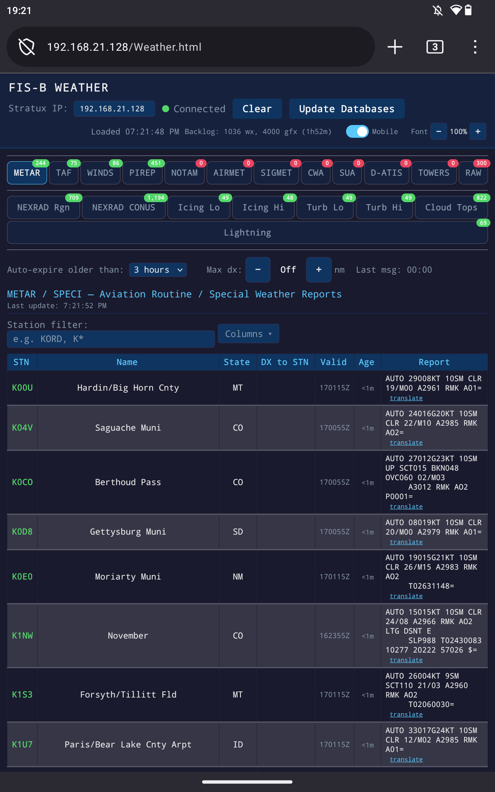

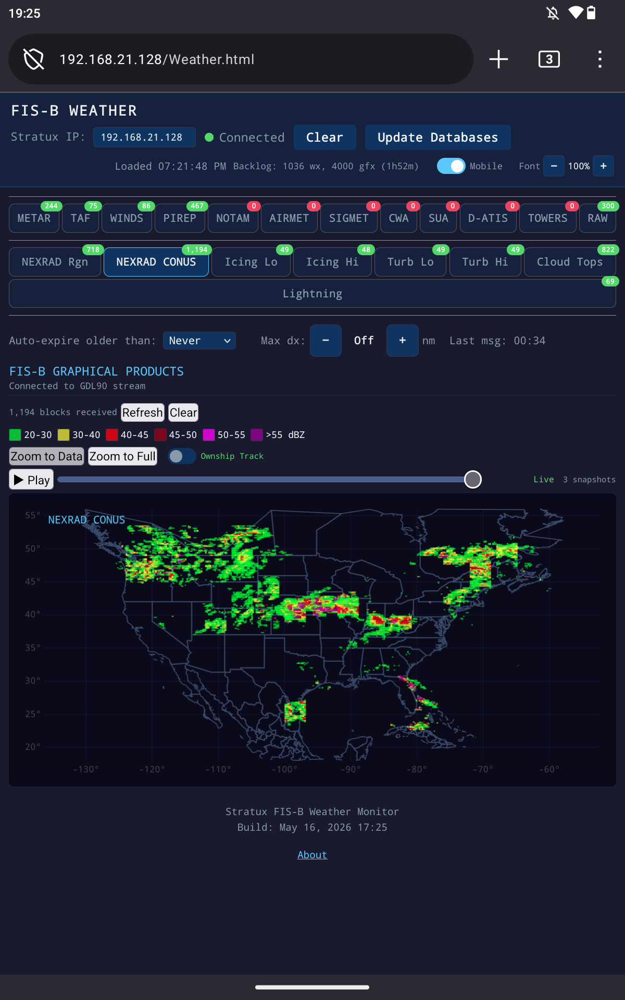

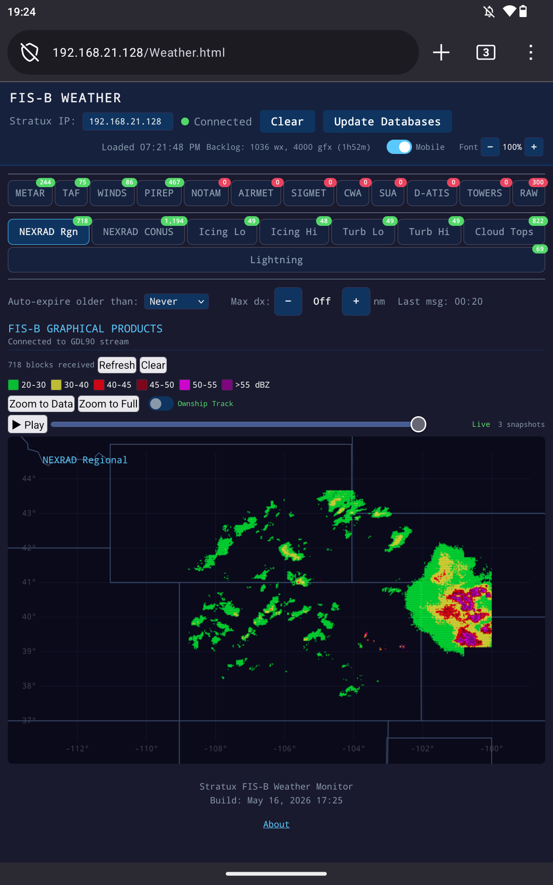

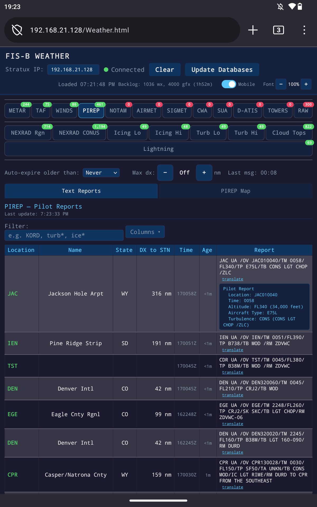

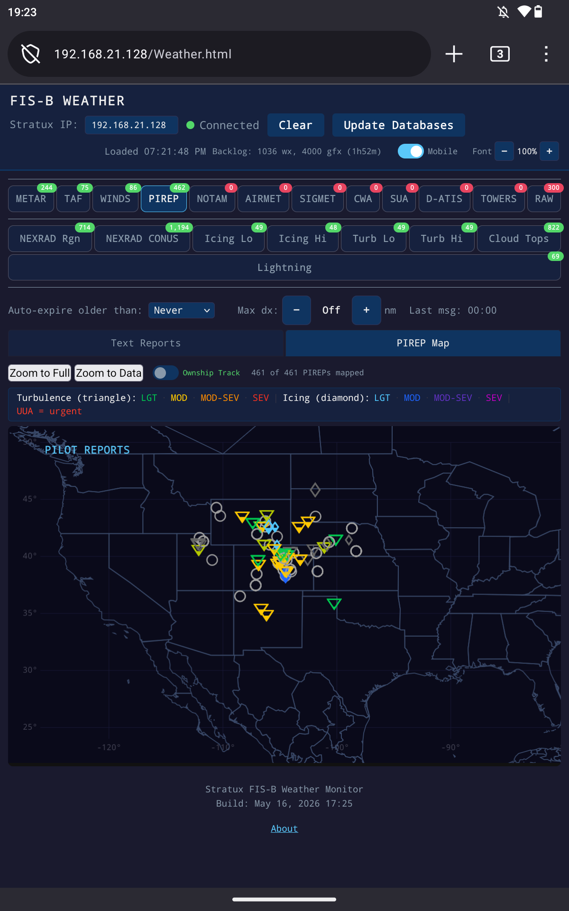

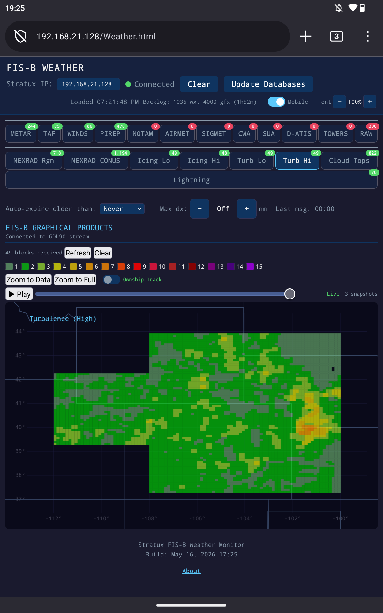

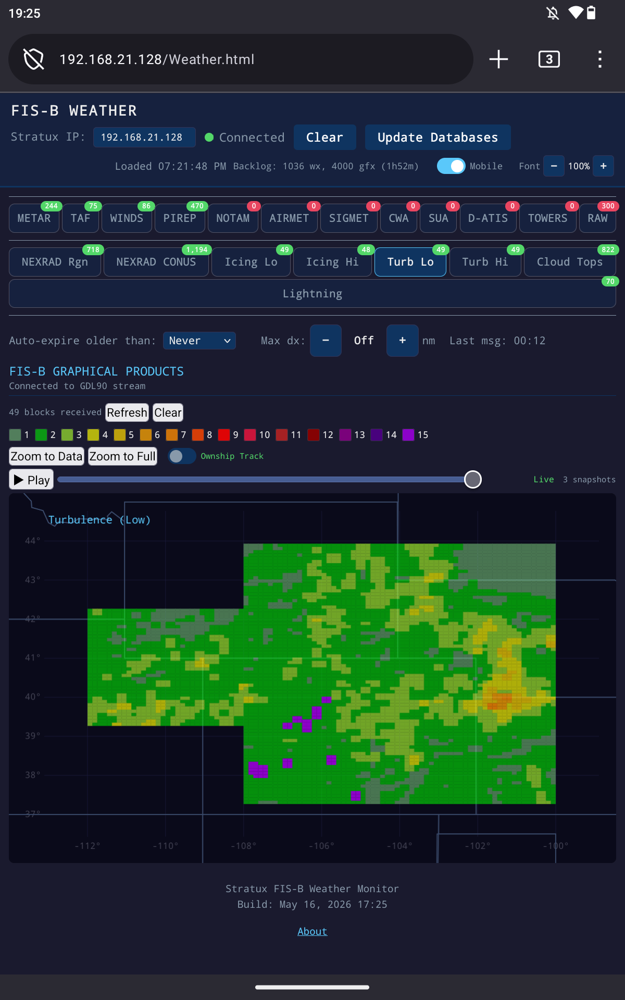

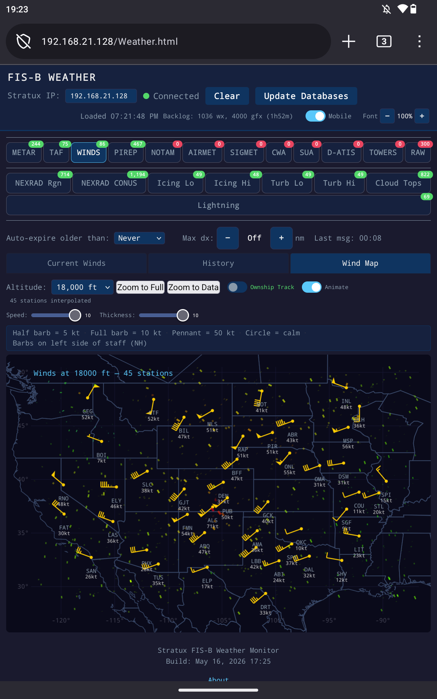
